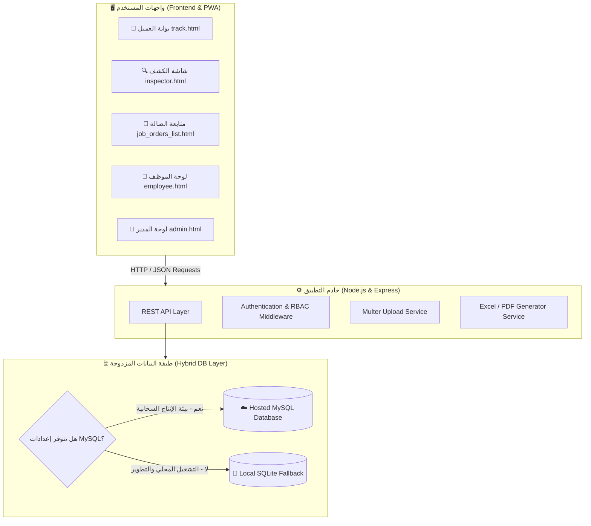

# 🚗 نظام أتينزا لإدارة ورش ومراكز صيانة السيارات | Atenza Workshop Manager

<div align="center">

[](https://nodejs.org/)
[](https://expressjs.com/)
[](https://www.mysql.com/)
[](https://web.dev/progressive-web-apps/)
[](LICENSE)
[](https://github.com/)

**نظام سحابي وهجين متكامل، فائق السرعة، ومصمم خصيصاً لإدارة عمليات ورش ومراكز صيانة السيارات بكفاءة واحترافية عالية.**

[المميزات الرئيسية](#-المميزات-الرئيسية) • [مصفوفة الصلاحيات](#-مصفوفة-الصلاحيات-والأدوار-rbac) • [المعمارية التقنية](#-المعمارية-التقنية) • [دليل التثبيت والتشغيل](#-دليل-التثبيت-والتشغيل-السريع) • [هيكل المشروع](#-هيكل-المشروع) • [التوثيق السحابي](#-إعداد-متغيرات-البيئة-والمتغيرات-السحابية)

</div>

---

## 📖 نبذة عن النظام (Overview)

**Atenza Workshop Manager** هو منصة تشغيلية شاملة تربط بين كافة أطراف مركز الصيانة: **الإدارة العامة، مسؤولي الاستقبال، فنيي الكشف، مهندسي الكهرباء والميكانيكا، والعملاء**.

يقدم النظام حلاً رقمياً متكاملاً يستبدل النماذج الورقية بالكامل عبر:
* أتمتة دورة حياة صيانة المركبة من لحظة الدخول حتى التسليم.
* كروت تشغيل تفاعلية بمخططات أضرار الهيكل وتوقيع العميل الرقمي.
* توثيق مرئي قبل وبعد الصيانة (Visual Inspection Photos).
* شاشات تتبع ومراقبة حية لصالة العمل والرافعات في الوقت الفعلي.
* بوابة عميل خارجية تتيح للعميل متابعة صيانة سيارته وفاتورته خطوة بخطوة من جواله دون تسجيل دخول.
* نظام شؤون موظفين متطور يشمل تسجيل الحضور بالبصمة الجغرافية (Geofencing GPS) ومسيرات الرواتب.

---

## ✨ المميزات الرئيسية (Core Features)

```
                       ┌────────────────────────────────────────────────────────┐
                       │               نظام أتينزا لإدارة الورش                │
                       └────────────────────────────────────────────────────────┘
                                                    │
         ┌──────────────────┬───────────────────────┼───────────────────────┬──────────────────┐
         │                  │                       │                       │                  │
         ▼                  ▼                       ▼                       ▼                  ▼
  🔍 الفحص والتسعير    🛠️ أوامر العمل والرافعات  👥 العملاء والـ CRM    📱 بوابة العميل والتتبع  💼 الموظفين والمالية
  • مخطط رسم الصدمات  • كروت تشغيل تفاعلية   • سجل مركبات العميل   • تتبع مباشر بالرابط   • بصمة GPS جغرافية
  • توقيع العميل الرقمي • مراقبة إشغال الرافعة • استيراد جماعي Excel • إشعارات واتساب فورية • مسيرات الرواتب والسلف
  • تحويل فوري لأمر عمل • قائمة فحص Checklist • تصحيح أرقام الهواتف  • تقرير الفحص والصور  • تقارير الدخل والأرباح
```

### 1. 🔍 نظام الفحص الفني والتسعيرات الذكي (Smart Inspection & Quotations)
* **فحص فني شامل:** تسجيل بيانات العميل، نوع السيارة، الموديل، رقم اللوحة، والعداد (KM).
* **مخطط أضرار هيكل السيارة التفاعلي:** رسم وتحديد مواضع الصدمات والخدوش بدقة على مجسم السيارة التفاعلي لتوثيق حالة المركبة عند الاستلام.
* **توقيع العميل الإلكتروني (Digital Signature):** لوحة توقيع إلكترونية تعمل باللمس على الجوال والأجهزة اللوحية لحفظ موافقة العميل على الفحص والتسعيرة.
* **التحويل الفوري لأمر عمل (One-Click Job Order Conversion):** تحويل الكشف المعتمد فوراً إلى كرت عمل وتشغيل فني بضغطة زر دون إعادة إدخال البيانات.
* **طباعة احترافية A4:** تصميم جاهز للطباعة المباشرة مع الشعار والبيانات الرسمية والشروط وتصدير PDF.

---

### 2. 🚗 لوحة متابعة صالة العمل وكروت التشغيل (Live Workshop Tracker & Job Cards)
* **متابعة حية للمركبات داخل الورشة:** شاشة مركزية تفاعلية (`job_orders_list.html`) تعرض جميع السيارات داخل المركز مع مؤشرات الحالة التشغيلية.
* **إدارة الحالات المباشرة:**
  * ⏳ `قيد الانتظار`
  * ⚙️ `جاري العمل`
  * 📦 `بانتظار قطع غيار`
  * ✅ `جاهزة للتسليم`
  * 🏁 `تم التسليم`
* **قائمة فحص المهام لكل فني (Service Checklist):** تمكين الفنيين من تأشير كل خدمة كـ "مكتملة" مع توثيق اسم الفني المنفذ وتوقيت الإنجاز الدقيق.
* **مؤشر تقدم الصيانة اللحظي (Real-time Progress Bar):** حساب نسبة إنجاز العمل تلقائياً بناءً على عدد الخدمات المنفذة.

---

### 3. 📸 التوثيق المرئي بالصور من الجوال (Before & After Photos)
* **التقاط الصور بالكاميرا مباشرة:** دعم رفع وتصوير السيارة عند الاستلام، توثيق القطع التالفة، وتوثيق النتيجة بعد انتهاء أعمال الصيانة.
* **تخزين منظم وسريع:** معالجة ورفع الصور فورياً مع ربطها التلقائي بكرت العمل وملف العميل.
* **الشفافية مع العميل:** تظهر الصور الملتقطة تلقائياً في بوابة التتبع الخاصة بالعميل.

---

### 4. 🏗️ إدارة ومراقبة الرافعات (Lifts & Bays Management)
* **شاشة تفاعلية لرافعات المركز (`lifts.html`):** رصد لحظي لحالة كل رافعة (شاغرة 🟢 / مشغولة 🔴 / تحت الصيانة 🟡).
* **إسناد وتعيين فوري:** ربط أمر العمل ورقم لوحة السيارة والفني المسؤول بالرافعة.
* **إخلاء سريع بنقرة واحدة:** تفريغ الرافعة بمجرد خروج السيارة وتحديث حالتها لجميع المستخدمين.

---

### 5. 📱 بوابة العميل للتتبع المباشر وأتمتة الواتساب (Client Portal & WhatsApp)
* **رابط تتبع خارجي بدون تسجيل دخول (`track.html`):** صفحة سلسة ومتوافقة بالكامل مع الهواتف الذكية تتيح للعميل:
  * متابعة مرحلة الصيانة الحالية ونسبة الإنجاز.
  * استعراض بنود الفحص والخدمات وتكلفة الصيانة.
  * مشاهدة صور السيارة والأعطال قبل وبعد الإصلاح.
* **المشاركة السريعة عبر الواتساب (WhatsApp Integration):** أزرار ذكية ترسل رسائل مخصصة مع رابط التتبع وفاتورة الفحص للعميل مباشرة بنقرة واحدة.

---

### 6. 👥 إدارة العملاء وسجل المركبات (CRM & Clients Manager)
* **سجل عملاء شامل (`clients_manager.html`):** بحث لحظي فوري بالاسم أو رقم الجوال أو رقم اللوحة.
* **سجل الصيانة التاريخي:** استعراض تاريخ الزيارات السابقة لكل عميل، سياراته المسجلة، وإجمالي المبالغ المدفوعة.
* **استيراد جماعي من Excel:** استيراد آلاف سجلات العملاء بضغطة زر مع المعالجة الذكية والتصحيح التلقائي لصيغ أرقام الهواتف السعودية والدولية.

---

### 7. 💼 نظام شؤون الموظفين والبصمة الذكية (HR & Smart Attendance)
* **تسجيل حضور وانصراف بالبصمة الجغرافية (Geofencing GPS):** التحقق التلقائي من تواجد الموظف داخل النطاق الجغرافي المحدد للورشة قبل اعتماد الحضور.
* **بوابة الموظف الذكية (`employee.html`):** تمكين الموظف من متابعة سجل دوامه، تقديم طلبات السلف والإجازات، واستعراض أوامر العمل المسندة إليه.
* **مسيرات الرواتب والمستحقات:** احتساب ساعات العمل، التأخيرات، الغياب، السحوبات، والخصومات، مع توليد تقارير مسيرات الرواتب وطباعتها وتصديرها لـ Excel.

---

### 8. 💰 التقارير المالية والإحصائيات (Financial Reports & Analytics)
* **لوحة تحكم إحصائية تفاعلية (`income_report.html`):** استعراض الإيرادات، الأرباح، متوسط قيمة الفواتير، ونسب نمو الأقسام.
* **فلترة زمنية ذكية:** تقارير حسب اليوم، الأسبوع، الشهر، أو فترات مخصصة.
* **تصدير متعدد الصيغ:** دعم تصدير البيانات إلى ملفات Excel (`.xlsx`) وتقارير PDF عالية الجودة.

---

### 9. 🎨 تخصيص الهوية والشروط (White-Labeling & System Settings)
* **تغيير اسم وهوية المركز:** تعديل اسم المركز وشعاره مباشرة من واجهة الإعدادات (`settings.html`) ليتم تطبيقه فوراً عبر كافة الصفحات والشاشات.
* **تخصيص شروط الفحص والضمان:** ضبط النصوص القانونية والشروط وبنود الضمان التي تظهر في الفواتير وكروت العمل.
* **إدارة الخدمات والباقات:** شاشات مرنة لإدارة مصفوفة الخدمات الفردية وباقات الصيانة السريعة (`services_manager.html`, `shortcuts_manager.html`).

---

## 🛡️ مصفوفة الصلاحيات والأدوار (RBAC)

يوفر النظام نظام حماية وصلاحيات دقيق مبني على الأدوار والأقسام لضمان أمان البيانات وتنظيم العمل:

| الدور / القسم | تعديل أوامر العمل 🛠️ | تعديل وإنشاء التسعيرة 📋 | استعراض سيارات المركز 🚗 | نطاق استعراض الأوامر | استعراض الكشوفات السابقة 📄 | الصلاحيات الإدارية والحذف 👑 |
| :--- | :---: | :---: | :---: | :---: | :---: | :---: |
| **👑 المدير العام (Admin)** | ✅ متاح | ✅ متاح | ✅ متاح | كافة سيارات وأوامر المركز | ✅ متاح (تعديل + تحويل) | ✅ تحكم كامل مع الحذف والرواتب |
| **🏢 موظفو الإدارة (Management)** | ✅ متاح | ✅ متاح | ✅ متاح | كافة سيارات وأوامر المركز | ✅ متاح (تعديل + تحويل) | 🔒 تعديل وتحويل (بدون حذف) |
| **🔍 موظفو الكشف والاستقبال** | 🔒 عرض فقط | ✅ متاح | ✅ متاح | كافة سيارات وأوامر المركز | ✅ متاح (تعديل + تحويل) | ❌ غير مصرح |
| **⚡ موظفو الكهرباء (Electricity)** | ❌ غير مصرح | ❌ غير مصرح | ✅ متاح | **الكروت المسندة للموظف فقط** | ✅ استعراض وطباعة فقط | ❌ غير مصرح |
| **🔧 موظفو الميكانيكا (Mechanics)** | ❌ غير مصرح | ❌ غير مصرح | ✅ متاح | **الكروت المسندة للموظف فقط** | ❌ غير مصرح | ❌ غير مصرح |

---

## 🏗️ المعمارية التقنية (Technical Architecture)

يعتمد النظام على معمارية هجينة متطورة توفر أقصى درجات الاستقرار والسرعة:



### 🛠️ التقنيات المستخدمة (Tech Stack)
* **Frontend:** HTML5 Semantic Elements, Modern CSS3 (Custom Design System, Glassmorphism & Micro-animations), Vanilla JavaScript (ES6+), PWA (Service Workers & Web App Manifest).
* **Backend:** Node.js, Express.js.
* **Database Layer:**
  * **السحابي (Production):** MySQL 8.x عبر تجمع اتصالات عالي الأداء (`mysql2/promise`).
  * **المحلي (Offline/Fallback):** SQLite 3 عبر (`sqlite3`) للعمل الفوري بدون إعداد خوادم.
* **File Processing & Exports:** Multer (إدارة رفع الصور)، ExcelJS & SheetJS (تصدير واستيراد ملفات الإكسل).
* **UI Components:** FontAwesome Icons, Google Cairo Typography, Custom Toast Notifications.

---

## 📁 هيكل المشروع (Project Structure)

```
workshop-manager/
├── 📄 server.js                  # خادم Express الرئيسي وتعريف مسارات REST APIs
├── 📄 db.js                      # محرك قواعد البيانات الهجين (MySQL / SQLite) والتهجير التلقائي
├── 📄 package.json               # حزم المشروع والاعتماديات
├── 📄 style.css                  # نظام التنسيق والتصميم الأساسي
├── 📄 toast.js / toast.css       # نظام الإشعارات المنبثقة التفاعلية
├── 📄 sw.js / manifest.json      # ملفات مشغل تطبيق الويب التقدمي (PWA)
│
├── 🌐 صفحات النظام (Views):
│   ├── 🔐 login.html             # بوابة تسجيل الدخول الموحدة
│   ├── 👑 admin.html             # لوحة تحكم المدير، إدارة الموظفين، والرواتب
│   ├── 👤 employee.html          # بوابة الموظف، بصمة الحضور GPS، والمهام
│   ├── 🔍 inspector.html         # محرر الكشوفات الفنية والتسعيرات ومخطط الهيكل
│   ├── 📋 inspections_list.html  # سجل وأرشيف الكشوفات السابقة مع الفلترة
│   ├── 🚗 job_orders_list.html   # لوحة تتبع سيارات صالة العمل الحية
│   ├── 🛠️ job_order.html         # كرت التشغيل الفني، التوثيق بالصور، وقائمة المهام
│   ├── 🏗️ lifts.html             # نظام مراقبة وإشغال رافعات الورشة
│   ├── 👥 clients_manager.html   # إدارة سجلات العملاء وسياراتهم والـ CRM
│   ├── ⚙️ services_manager.html  # إدارة مصفوفة الخدمات والأسعار
│   ├── ⚡ shortcuts_manager.html # باقات الكشف والاختصارات السريعة
│   ├── 💰 income_report.html     # التقارير المالية وتصدير الإيرادات
│   ├── 🎯 marketing.html         # الحملات التسويقية وقوالب رسائل الواتساب
│   ├── 📱 track.html             # بوابة العميل لمتابعة الصيانة المباشرة
│   └── ⚙️ settings.html          # مركز إعدادات الهوية، الدوام، وشروط الكشف
│
├── 📁 uploads/                   # مجلد تخزين صور السيارات وتوثيق الفحص
└── 📁 public/                    # الأصول الثابتة والإعدادات المركزية
```

---

## 🚀 دليل التثبيت والتشغيل السريع (Installation & Quick Start)

### 1. المتطلبات الأساسية
* تثبيت بيئة **[Node.js](https://nodejs.org/)** (الإصدار 18 أو أحدث).
* مدير الحزم `npm` (يأتي مدمجاً مع Node.js).

### 2. استنساخ المشروع وتثبيت الحزم
```bash
# 1. استنساخ المستودع
git clone https://github.com/your-username/workshop-manager.git

# 2. الدخول إلى مجلد المشروع
cd workshop-manager

# 3. تثبيت الاعتماديات
npm install
```

### 3. التشغيل المحلي (Development Mode)
```bash
# تشغيل الخادم
npm start
# أو
node server.js
```
*أو على أنظمة Windows، يمكنك تشغيل النظام فورياً بالنقر المزدوج على ملف `start.bat`.*

### 4. فتح النظام
افتح المتصفح وتوجه إلى:
```
http://localhost:8080
```

---

## 🔐 بيانات تسجيل الدخول الافتراضية

| نوع الحساب | اسم المستخدم (Username) | كلمة المرور (Password) | الصلاحية |
| :--- | :--- | :--- | :--- |
| **المدير العام** | `admin` | `admin123` | وصول كامل لكافة شاشات وإعدادات النظام |
| **الموظفون والفنيون** | يتم إنشاؤهم من شاشة `admin.html` | حسب الإنشاء | وفق القسم المحدد (كشف، كهرباء، ميكانيكا، إدارة) |

---

## ☁️ إعداد متغيرات البيئة والنشر السحابي (Environment Variables)

النظام مهيأ تلقائياً للعمل المباشر على منصات الاستضافة السحابية والحاويات مثل:  
**(Railway, Render, AiroApp, VPS, Docker, cPanel)**.

قم بإنشاء ملف `.env` في المجلد الرئيسي أو ضبط المتغيرات في لوحة تحكم الاستضافة السحابية:

```env
# المنفذ وبيئة التشغيل
PORT=8080
NODE_ENV=production

# إعدادات قاعدة بيانات MySQL السحابية
DB_HOST=your_mysql_host.example.com
DB_PORT=3306
DB_NAME=workshop_database
DB_USER=workshop_user
DB_PASSWORD=your_secure_password
```

> **ملاحظة ذكية:** في حال عدم ضبط متغيرات `DB_HOST`، سيقوم النظام تلقائياً وبكل سلاسة بالعمل على قاعدة بيانات SQLite المحلية (`db.sqlite`) دون أي تعطل.

---

## 📱 تثبيت التطبيق على الهواتف والأجهزة (PWA Installation)

النظام يدعم تقنية **Progressive Web App (PWA)** بالكامل:
* **على الهواتف (Android / iOS):** اضغط على خيار *"إضافة إلى الشاشة الرئيسية"* من المتصفح ليعمل النظام كتطبيق هاتف أصلي بملء الشاشة وسرعة فائقة.
* **على أجهزة الكمبيوتر (Windows / Mac):** اضغط على أيقونة التثبيت في شريط عنوان المتصفح لتثبيته كتطبيق مكتبي مستقل.

---

## 🔌 نبذة عن واجهات الـ REST API

يوفر النظام مجموعة شاملة من مسارات الـ API لتنفيذ كافة العمليات البرمجية:

| المسار (Endpoint) | الطريقة | الوصف |
| :--- | :---: | :--- |
| `/api/login` | `POST` | مصادقة المستخدم والتحقق من كلمة المرور والصلاحية |
| `/api/inspections` | `GET / POST` | جلب قائمة الكشوفات أو حفظ كشف فحص وتسعيرة جديدة |
| `/api/inspections/:id` | `GET / PUT / DELETE` | استعراض، تعديل، أو حذف كشف محدد |
| `/api/job-orders` | `GET / POST` | استعراض سيارات المركز أو إنشاء أمر عمل جديد |
| `/api/job-orders/:id/status` | `PUT` | تحديث الحالة التشغيلية لأمر العمل (انتظار، عمل، جاهز، تسليم) |
| `/api/job-orders/:id/services/:idx` | `PUT` | تحديث حالة إنجاز بند صيانة معين داخل كرت التشغيل |
| `/api/lifts` | `GET / PUT` | مراقبة وتحديث حالة وإشغال رافعات المركز |
| `/api/clients` | `GET / POST` | البحث في قاعدة بيانات العملاء وإضافة عميل جديد |
| `/api/clients/import-excel` | `POST` | استيراد سجلات العملاء جماعياً من ملف Excel |
| `/api/attendance` | `GET / POST` | تسجيل بصمة الحضور الجغرافية GPS وسجل الحضور |
| `/api/upload` | `POST` | رفع صور توثيق الفحص والأعطال قبل وبعد الصيانة |

---

## 🤝 المساهمة والتطوير (Contributing)

نرحب بكافة المساهمات والاقتراحات لتحسين النظام وتطويره:
1. قم بعمل **Fork** للمشروع.
2. أنشئ فرعاً للميزة الجديدة (`git checkout -b feature/AmazingFeature`).
3. احفظ التعديلات (`git commit -m 'Add some AmazingFeature'`).
4. ارفع التعديلات للفرع (`git push origin feature/AmazingFeature`).
5. افتح **Pull Request** لمراجعة التعديلات ودمجها.

---

## 📄 الترخيص (License)

هذا المشروع مرخص تحت رخصة **MIT** - راجع ملف [LICENSE](LICENSE) لمزيد من التفاصيل.

<div align="center">

صُمم وطُوّر بكل ❤️ لتقديم تجربة تشغيلية متفوقة لمراكز صيانة السيارات.

</div>
